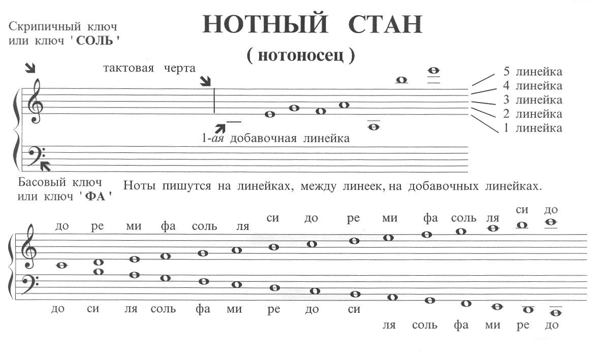
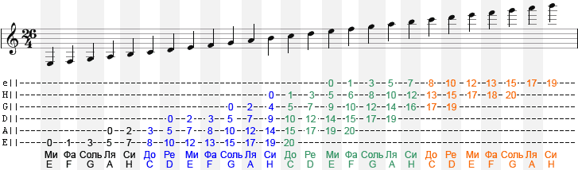

## Звук

Любой звук имеет следующие характеристики:

- высота
- длительность
- громкость

Не все звуки могут образовывать музыку.

---

## Основные понятия

- Нота - звук определенной высоты, записанный специальным образом
- Интервал - соотношение двух нот по высоте
- Полутон - наименьшая единица расстояния между звуками
- Тон - два полутона
- Аккорд - сочетание трех и более нот разной высоты, звучащих одновременно

---

## Буквенные обозначения нот

| Русское название        | Латинское (английское) | Альтерация (диез/бемоль)     |
|-------------------------|------------------------|------------------------------|
| До                      | C                      | C# (до-диез), Cb (до-бемоль) |
| Ре                      | D                      | D#, Db                       |
| Ми                      | E                      | E#, Eb                       |
| Фа                      | F                      | F#, Fb                       |
| Соль                    | G                      | G#, Gb                       |
| Ля                      | A                      | A#, Ab                       |
| Си (в англ.)            | B                      | B#, Bb                       |
| Си (в немецкой системе) | H*                     | H#, Hb (в немецкой)          |

**Примечания**:

- В международной (английской) системе используется **B** для ноты *си*, а **Bb** — для *си-бемоль*.
- В немецкой системе **H** — это *си*, а **B** — *си-бемоль* (в таблице отмечено звёздочкой).
- Диез обозначается символом `#`, бемоль — `b` (латинская буква b, в некоторых нотациях используется flat `♭`).

---

## Музыкальные интервалы

| Название интервала              | Ступени | Полутонов | Пример от C (вверх) |
|---------------------------------|---------|-----------|---------------------|
| **Чистая прима** (унисон)       | 1       | 0         | C – C               |
| **Малая секунда**               | 2       | 1         | C – C# (или Db)     |
| **Большая секунда**             | 2       | 2         | C – D               |
| **Малая терция**                | 3       | 3         | C – Eb              |
| **Большая терция**              | 3       | 4         | C – E               |
| **Чистая кварта**               | 4       | 5         | C – F               |
| **Увеличенная кварта** (тритон) | 4       | 6         | C – F#              |
| **Чистая квинта**               | 5       | 7         | C – G               |
| **Малая секста**                | 6       | 8         | C – Ab              |
| **Большая секста**              | 6       | 9         | C – A               |
| **Малая септима**               | 7       | 10        | C – Bb              |
| **Большая септима**             | 7       | 11        | C – B               |
| **Чистая октава**               | 8       | 12        | C – c               |

**Примечания:**

- Интервалы бывают **чистые** (прима, кварта, квинта, октава), **большие/малые** (секунда, терция, секста, септима), *
*увеличенные/уменьшённые** (например, увеличенная кварта = тритон).
- В примерах использованы стандартные обозначения: диез `#`, бемоль `b`. Для чистых интервалов указаны только основные
тоны.
- Количество полутонов считаем в равномерно-темперированном строе.

### Составные интервалы

| Название интервала        | Ступеней | Полутонов | Пример от C (вверх)              |
|---------------------------|----------|-----------|----------------------------------|
| **Децима** (малая)        | 10       | 15        | C – Eb' (ми-бемоль через октаву) |
| **Децима** (большая)      | 10       | 16        | C – E' (ми через октаву)         |
| **Ундецима** (чистая)     | 11       | 17        | C – F' (фа через октаву)         |
| **Увеличенная ундецима**  | 11       | 18        | C – F#' (фа-диез через октаву)   |
| **Дуодецима** (чистая)    | 12       | 19        | C – G' (соль через октаву)       |
| **Терцдецима** (малая)    | 13       | 20        | C – Ab' (ля-бемоль через октаву) |
| **Терцдецима** (большая)  | 13       | 21        | C – A' (ля через октаву)         |
| **Квартдецима** (малая)   | 14       | 22        | C – Bb' (си-бемоль через октаву) |
| **Квартдецима** (большая) | 14       | 23        | C – B' (си через октаву)         |
| **Квинтдецима** (чистая)  | 15       | 24        | C – C'' (до второй октавы)       |

**Важные замечания:**

- Составные интервалы часто называют по их простому аналогу с добавлением слова «децима», «ундецима» и т.д. (от
латинских числительных: decima – десятая, undecima – одиннадцатая, duodecima – двенадцатая, tertia decima –
тринадцатая, quarta decima – четырнадцатая, quinta decima – пятнадцатая).
- Количество полутонов соответствует простому интервалу + 12 (октава). Например, чистая кварта (5 полутонов) + октава (
12) = чистая ундецима (17 полутонов).
- В примерах использованы ноты первой октавы для верхнего звука (обозначены штрихом `'`), чтобы показать, что они выше
основной октавы.

---

## Октавы

**Октава** — это интервал между двумя звуками с одинаковым названием, частоты которых относятся как 2:1. Воспринимается
как «та же нота, только выше/ниже».

В музыке принято деление на **октавные регистры**. Вот основные названия октав (от низких к высоким) с указанием их
диапазона в герцах (для ноты **ля** — A) и примерными границами:

| Название октавы  | Обозначение (научная нотация) | Диапазон частот (приблизительно) | Пример ноты (A) |
|------------------|-------------------------------|----------------------------------|-----------------|
| Субконтроктава   | C0 – B0                       | 16,35 – 30,87 Гц                 | A0 = 27,5 Гц    |
| Контроктава      | C1 – B1                       | 32,70 – 61,74 Гц                 | A1 = 55 Гц      |
| Большая октава   | C2 – B2                       | 65,41 – 123,47 Гц                | A2 = 110 Гц     |
| Малая октава     | C3 – B3                       | 130,81 – 246,94 Гц               | A3 = 220 Гц     |
| Первая октава    | C4 – B4                       | 261,63 – 493,88 Гц               | A4 = 440 Гц     |
| Вторая октава    | C5 – B5                       | 523,25 – 987,77 Гц               | A5 = 880 Гц     |
| Третья октава    | C6 – B6                       | 1046,50 – 1975,53 Гц             | A6 = 1760 Гц    |
| Четвёртая октава | C7 – B7                       | 2093,00 – 3951,07 Гц             | A7 = 3520 Гц    |
| Пятая октава     | C8 – B8                       | 4186,01 – 7902,13 Гц             | A8 = 7040 Гц    |

> **Примечание:** Нумерация в научной нотации (C4 = среднее **до**, A4 = 440 Гц — эталонная нота) принята в большинстве
> современных систем (MIDI, синтезаторы, программы).

> **Примечание 2:**
> На классической гитаре есть возможность взять ноты от частично большой октавы и не до конца третьей октавы.

---

## Нотный стан

---

## Гитарные табулатуры

---

## Динамические оттенки (громкость)

| Обозначение | Сокращение | Русский перевод | Характер |
|-------------|------------|-----------------|----------|
| pianissimo  | `pp`       | очень тихо      | едва слышно |
| piano       | `p`        | тихо            | спокойно, мягко |
| mezzo-piano | `mp`       | умеренно тихо   | средне-тихо |
| mezzo-forte | `mf`       | умеренно громко | средне-громко |
| forte       | `f`        | громко          | сильно, ярко |
| fortissimo  | `ff`       | очень громко    | мощно |
| forte-piano | `fp`       | громко, затем сразу тихо | контраст |
| sforzando   | `sfz`      | внезапный акцент| резкий удар |
| rinforzando | `rinf`     | усиление        | постепенное нарастание внутри фразы |

**Дополнительные нюансы:**
- `crescendo` (cresc.) – постепенное увеличение громкости.
- `diminuendo` (dim.) или `decrescendo` (decresc.) – постепенное уменьшение.

---

## Темповые обозначения (скорость)

| Обозначение     | Примерный темп (уд/мин)* | Характер |
|-----------------|--------------------------|----------|
| **Grave**       | 20–40                   | очень медленно, торжественно |
| **Largo**       | 40–60                   | широко, медленно |
| **Lento**       | 45–60                   | медленно, протяжно |
| **Adagio**      | 66–76                   | медленно, спокойно |
| **Andante**     | 76–108                  | шагом, не спеша |
| **Andantino**   | 80–108                  | чуть быстрее, чем Andante |
| **Moderato**    | 108–120                 | умеренно, сдержанно |
| **Allegretto**  | 112–120                 | умеренно быстро, оживлённо |
| **Allegro**     | 120–168                 | быстро, весело |
| **Vivace**      | 168–176                 | живо, оживлённо |
| **Presto**      | 168–200                 | очень быстро |
| **Prestissimo** | >200                    | максимально быстро |

> \* Темп может варьироваться в зависимости от эпохи и исполнительской традиции; указанные числа – приблизительные для метронома.

---

## Обозначения характера и штрихи

Иногда к темпу добавляются слова, уточняющие настроение:

| Термин           | Значение |
|------------------|----------|
| `dolce`          | нежно, мягко |
| `espressivo`     | выразительно |
| `legato`         | связно |
| `staccato`       | отрывисто |
| `marcato`        | подчёркнуто, акцентированно |
| `cantabile`      | певуче |
| `con brio`       | с огоньком |
| `con moto`       | с движением |

